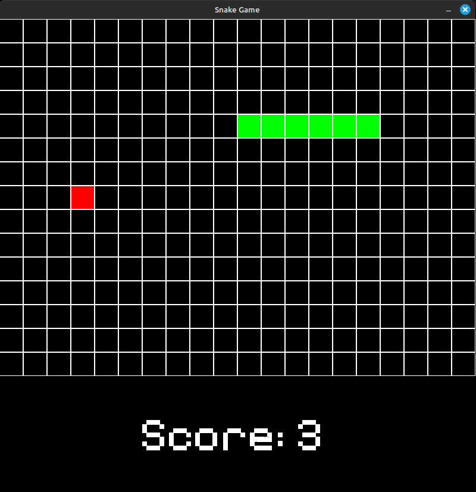

# C-Snake-Game


## About the Game

This is a classic Snake game developed in C using the SDL2 library. The game features a scoring system and background music for a more immersive experience.

## Features

- Smooth snake movement
- Collision detection with the snake's body
- Scoring system
- Continuous background music
- Sound effects when eating food

## How to Play

- Use the arrow keys to move the snake.
- Eat the food to grow and gain points.
- Avoid colliding with the snake's own body!

## Controls

- **Up Arrow**: Move up
- **Down Arrow**: Move down
- **Left Arrow**: Move left
- **Right Arrow**: Move right
- **Esc**: Exit the game

### Dependencies
Make sure you have all of these installed in your system:
- SDL2
- SDL2_ttf
- SDL2_mixer

### Compilation

To compile the game, use the following command:

```bash
make run
```bash

## Credits

### Sound Effects

- Background Music: [Soundtrack](https://www.youtube.com/watch?v=5y6z7SlcnI0&list=PLPBrp0Wr_HK9Sx4hh30feKyt6eSlEh3Zv&index=2)
- Eating Sound: [Sound Effect](https://www.youtube.com/watch?v=IPhQz0MA0AI)